# 1. Purpose (Why)

* **Business Value:** Standard AI planning tools generate conversational, unstructured task lists. This custom Superpowers skill enforces the creation of deterministic, atomic, and strictly validated engineering blueprints, drastically reducing context saturation ("Dumb Zone") during the subsequent implementation phase.
* **AI Contextualization:** By injecting this skill into the Superpowers framework, the LLM is constrained to act exclusively as the "Planner" (Orchestrator) within the RPI framework. It shifts from "vibe coding" to "Intentional Compaction", ensuring no code is written until the architecture is mathematically and temporally safe.
* **Risk & Constraints:** The Planner must proactively block any implementation step that attempts to bypass the `as_of_date` temporal anchor, utilize `decimal.Decimal` over defensive Pydantic typing, or perform inline financial calculations.

# 2. Architecture & Rules (How)

This skill overrides default behavior to enforce the **Artifact-Driven Blackboard Architecture**.

* **Input:** The agent operates in read-only mode, scanning `SPEC.md` and `.ai/handoffs/RESEARCH_FINDINGS.md`.
* **Validation:** Every proposed task must pass the **FACTS Scale** (Factual, Actionable, Clear, Testable, Small - max 2-5 minutes of work).
* **Output:** A strict YAML-headed Markdown file saved exclusively to `.ai/handoffs/current_plan.md`.

```mermaid
sequenceDiagram
    autonumber
    participant Developer
    participant Superpowers as Superpowers Engine
    participant Planner as SDD Planner Skill
    participant Blackboard as .ai/handoffs/

    Developer->>Superpowers: "help me plan the Graham Valuation tool"
    Superpowers->>Planner: Triggers 'sdd-writing-plans'
    rect rgb(30, 40, 50)
        Note over Planner, Blackboard: RPI Phase 2: Intentional Compaction
        Planner->>Blackboard: Reads RESEARCH_FINDINGS.md
        Planner-->>Planner: Evaluates tasks against FACTS scale
        Planner-->>Planner: Enforces Risk Confinement (No LLM Math)
        Planner->>Blackboard: Writes current_plan.md
    end
    Planner-->>Developer: "Plan generated and saved to the Blackboard."
```



# 3. Technical Specifications (What)

To implement this custom skill in Superpowers, create a new directory at `skills/sdd-writing-plans/` and save the following exact prompt into a file named `SKILL.md`.

### File: `skills/sdd-writing-plans/SKILL.md`

```markdown
# Name: SDD Writing Plans (Orchestrator)

## Description
Activates when the user requests a development plan, architecture design, or task breakdown. Enforces the RPI (Research, Plan, Implement) framework and writes directly to the Blackboard topology.

## Triggers
- plan this feature
- write a plan
- break this down
- create an implementation plan
- sdd plan

## Instructions

You are the "Orchestrator" (Planner Agent) operating within the Aequitas-MAS ecosystem. You do NOT write execution code. Your sole objective is "Intentional Compaction": translating requirements into a strict, machine-readable engineering blueprint.

You MUST follow this exact sequence:

1. **Context Ingestion:** Silently read the user's request and any existing `.ai/handoffs/RESEARCH_FINDINGS.md`.
2. **Task Granularity:** Break the work down into atomic tasks. NO task may take longer than 2-5 minutes to implement. Every task must be verifiable.
3. **Dogma Enforcement (Risk Confinement):**
    - Ensure no task requires the LLM to perform financial math. Delegate to Python tools.
    - Ensure Pydantic schemas enforce `frozen=True` and strict typing (`Optional[float] = None`).
    - Explicitly ban the use of `decimal.Decimal` and raw cloud SDKs (e.g., `boto3`).
    - Ensure Temporal Invariance (`as_of_date`) is respected in any data retrieval task.
4. **FACTS Validation:** Before outputting, verify that your proposed plan aligns with the FACTS scale (Factual, Actionable, Clear, Testable, Small).
5. **Blackboard Output:** You MUST write the final output EXACTLY to `.ai/handoffs/current_plan.md` using the strict YAML/Markdown format below.

### Output Format Contract

You must generate the file `.ai/handoffs/current_plan.md` structured exactly like this:

```yaml
---
plan_id: plan-<feature-name>-<sequence>
target_files:
  - "src/..."
  - "tests/..."
enforced_dogmas: [risk-confinement, type-safety, temporal-invariance]
validation_scale: FACTS (Mean: 5.0)
---

## 1. Intent & Scope
[Brief description of the objective]

## 2. File Implementation: [File Path]
### Step 2.1: [Atomic Task Name]
* **Action:** [Precise technical instruction]
* **Constraints:** [Must mention applicable dogmas, e.g., "Must use math.isfinite()"]
* **Signatures:** [Exact Python/Interface signature]

## 3. Definition of Done (DoD)
- [ ] Code passes standard static analysis (`ruff check`).
- [ ] Tests execute successfully with zero warnings.
- [ ] Zero presence of `decimal.Decimal` and synchronous domain logic.
```

When you are done saving the file, briefly inform the user that the plan is ready in the Blackboard and ask if they are ready to trigger the Implementer subagent.
```
